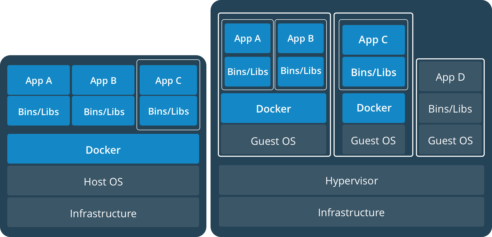

# raspi-ansible
This is a git repo to setup raspberries with ansible. All common tasks are done under the **pi** role. Additional roles are created for further setup of the various RPI's.

[Ansible](https://github.com/yeehazerog/raspi-ansible#the-ansible-part) | [CCTX](https://github.com/yeehazerog/raspi-ansible#interfaces-to-crypto-exchanges) | [Jupyter](https://github.com/yeehazerog/raspi-ansible#jupyter-installation)

## Ansible and Docker

A quick introduction as to why those two are important for this project.

> Ansible is a configuration management system used for application deployment.
> Ansible can be understood as set of tools and, Ansible's playbooks as instructions manuals for their usage.
> Ansible modules are accompanied by Playbooks that aid in the configuration and deployment to remote machines.
> Ansible helps you to automate Docker and operationalize the container build and deployment process. 
> Source: [Medium | Cabot Technology Solution](https://medium.com/@cabot_solutions/ansible-and-docker-the-best-combination-for-an-efficient-software-product-management-28c86cfebe90)

> Docker is an open source containerization platform that aids in the automation of application deployment within software containers.

The following image ([Source: djangostars](https://djangostars.com/blog/what-is-docker-and-how-to-use-it-with-python/)) illustrates the important difference the usage of docker brings vs. using a virtual machine.

Docker does not need the additional space for a operating systems per virutal machine.

**Terminology**

*  Container | Running instance that encapsulates required software. Containers are always created from images. Container can expose ports and volumes to interact with other containers or/and outer world. Container can be easily killed / removed and re-created again in a very short time.
*  Image | Basic element for every container. When you create an image every step is cached and can be reused (Copy On Write model). Depending on the image it can take some time to build it. Containers, on the other hand can be started from images right away.
*  Port | A TCP/UDP port in its original meaning. To keep things simple let’s assume that ports can be exposed to the outer world (accessible from host OS) or connected to other containers — accessible only from those containers and invisible to the outer world.
*  Volume | Can be described as a shared folder. Volumes are initialized when a container is created. Volumes are designed to persist data, independent of the container’s lifecycle.
*  Registry | The server that stores Docker images. It can be compared to Github — you can pull an image from the registry to deploy it locally, and you can push locally built images to the registry.
*  Docker hub | A registry with web-interface provided by Docker Inc. It stores a lot of Docker images with different software.

**Recommendations using Docker**

* 1 application = 1 container.
* Run process in foreground (don't use systemd, upstart or any other similar tools).
* Keep data out of container — use volumes.
* Do not use SSH (if you need to step into container you can use docker exec command).
* Avoid manual configurations (or actions) inside container.

Testing is very important to ensure that the deployment is done correctly. To ensure zero downtime and successfully run applications, the following is a good approach.

* Get the newest version of the application container
* Run the old application in parallel with the new one
* Run post-deployment tests
* Notify 'etcd' about the new release (port, name, etc)
* Convert 'nginx' configuration to point to the new release
* Finally, halt the old release

## Setup the Ansible host

1. Install pip 'pip install --user --upgrade pip', do not use 'sudo apt install pip', otherwise you are changing your distro's pip and that will cause [errors](https://github.com/pypa/pip/issues/5221).

## Preparation Steps for the raspberries

1. Flash SD card with raspbian OS [raspbian-stretch-lite](https://downloads.raspberrypi.org/raspbian_lite_latest) using [etcher](https://etcher.io/)
2. Create an empty file (no extension necessary) named 'ssh' on the root folder of the SD card (to enable SSH access to RPI3)
3. put SD card into the raspberry and boot the raspberry
4. Create SSH keys on ansible host `ssh-keygen -t rsa -b 4096 -C "<any comment>"`
5. Make sure the hosts are clean `ssh-keygen -f "home/<user>/.ssh/known_hosts" -R <IP adress>`
6. Copy SSH keys to RPI3 `ssh-copy-id username@IP-address` (RPI standard user is 'pi'). Thx to <https://hvops.com/articles/ansible-post-install/> for the hint.

## The Ansible Part

> Thanks to <http://justin.isamaker.com/ansible-pi/> for providing very nice playbooks to setup the raspberry. This was the basis for the work done here.

### Creating Role Framework
> Thanks to the guys from [digitalocean for their nice summary of roles](https://www.digitalocean.com/community/tutorials/how-to-use-ansible-roles-to-abstract-your-infrastructure-environment).

Roles are created fro everything that shall be setup (e.g. Jupyter). 

7. In the roles a directory `jupyter` is created. 
8. In 'jupyter' sub-directories `mkdir files handlers meta templates tasks vars` are placed.

This is what they are all for:

 * files: This directory contains regular files that need to be transferred to the hosts you are configuring for this role. This may also include script files to run.
 * handlers: All handlers that were in your playbook previously can now be added into this directory.
 * meta: This directory can contain files that establish role dependencies. You can list roles that must be applied before the current role can work correctly.
 * templates: You can place all files that use variables to substitute information during creation in this directory.
 * tasks: This directory contains all of the tasks that would normally be in a playbook. These can reference files and templates contained in their respective directories without using a path.
 * vars: Variables for the roles can be specified in this directory and used in your configuration files.

Within all of the directories but the "files" and "templates", if a file called main.yml exists, its contents will be automatically added to the playbook that calls the role.

## The Docker part

Wait, we have jsut setup Ansible - it will make sure that all our raspberries are setup in exactly the same way and then specific additions are made if needed to some of them. Now why do we need Docker and what for?

> Automate Docker with Ansible
> Ansible is the way to automate Docker in your environment. Ansible enables you to operationalize your Docker container build and deployment process in ways that you’re likely doing manually today, or not doing at all.
> Ansible can model containers and non-containers at the same time. This is especially important, as containerized applications are nearly always talking to components — storage, database, networking — that are not containerized, and frequently not even containerizable. And with Ansible Tower, you can deploy your host environments, your containers, and your services with the push of a button.
> [Source: Ansible.](https://www.ansible.com/integrations/containers/docker)

In order to use Docker and Ansible, 'docker-py' needs to be available on the Ansible host 'pip install 'docker-py>=1.7.0'', and 'docker-compose' is needed as well 'pip install 'docker-compose>=1.7.0''.

> Thanks to [Nick Janetakis ansible-docker](https://github.com/nickjj/ansible-docker) which provides an excellent source for the setup of docker.

A role is added to ansible 'docker' which installs docker on the raspberry. The sources for information are stated in the respective yml files (e.g. where to find the apt key for docker)

## Mongo DB

Get [Mongo DB from store.docker.com](https://store.docker.com/images/mongo) via 'docker pull mongo'.

## Interfaces to crypto exchanges

Thanks to the amazing code published as [CCXT – CryptoCurrency eXchange Trading Library](https://github.com/ccxt/ccxt) the basis for getting the needed data is found. This section will deal with the addition of the relevant parts of that codebase.

## Jupyter installation

The installation of jupyter requires you to have `python3-dev` installed. Also please consider the difference in using `pip` vs. `python -m pip` to install jupyter, read here for more info (https://jakevdp.github.io/blog/2017/12/05/installing-python-packages-from-jupyter/)

